# Especificação do Projeto Ray-Tracing

Neste projeto da disciplina de Processamento Gráfico, os alunos colocarão em prática o conceito de renderização implementando **o algoritmo *Ray-Tracing*. Só podem ser importada bibliotecas pré-existentes com os seguintes propósitos:

- Para leitura do arquivo de entrada contendo a descrição da cena (e.g. [json](https://docs.python.org/3/library/json.html));
- Para manipulação da imagem de saída (e.g. [Matplotlib](https://matplotlib.org/stable/api/_as_gen/matplotlib.pyplot.imsave.html), [PIL](https://pillow.readthedocs.io/en/stable/reference/Image.html#PIL.Image.fromarray), [ppm](https://raytracing.github.io/books/RayTracingInOneWeekend.html#outputanimage/theppmimageformat));
- Para operações vetoriais e álgebra linear (e.g. [NumPy](https://numpy.org/doc/stable/reference/generated/numpy.cross.html), [GLM](https://github.com/g-truc/glm/blob/master/manual.md#-84-lighting)).

Todo o resto deverá ser implementado do zero.

Os requisitos serão especificados em quatro marcos de complexidade. Cada versão do projeto estende a anterior com a adição de novas *features*. A quarta versão vale ponto extra, e as duas primeiras definem como serão dadas as pontuações parciais para os trabalhos incompletos.

| Feature | Pontuação | Acumulado |
| --- | --- | --- |
| Câmera variando posição e orientação | 0,2 | 0,2 |
| Raios primários em perspectiva | 0,2 | 0,4 |
| Interseção raio-esfera | 0,1 | 0,5 |
| Interseção raio-plano | 0,1 | 0,6 |
| Interseção raio-triângulo | 0,2 | 0,8 |
| Encontrar o objeto mais à frente | 0,2 | 1,0 |
| Componente ambiental | 0,1 | 1,1 |
| Componente difusa | 0,1 | 1,2 |
| Componente especular | 0,1 | 1,3 |
| Múltiplas fontes pontuais de luz | 0,1 | 1,5 |
| Objetos e luzes com cores variadas | 0,1 | 1,6 |
| Correção de color overflow | 0,1 | 1,7 |
| Raios de sombra | 0,2 | 1,9 |
| Correção de shadow acne | 0,1 | 2,0 |
| Raios secundários refletidos | 0,2 | 2,2 |
| Raios secundários refratados | 0,2 | 2,4 |
| Reflexão total | 0,1 | 2,5 |
| Antialiasing | 0,2 | 2,7 |
| Soft Shadows | 0,3 | 3,0 |

# Versão 1 (40%)

**Objetivo**: fazer aparecer apenas os contornos dos objetos, sem *shading*.

[Testes Versão 1](items/testes-1)

## Câmera

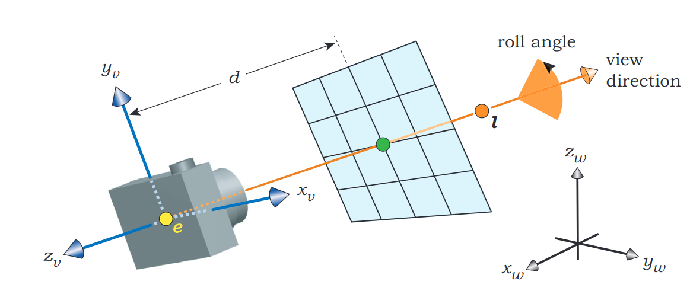

Deve ser possível mover a câmera de posição, bem como rotacioná-la em torno do seu próprio eixo. Para tal, é preciso estabelecer o sistema de coordenadas da câmera (em azul), que é diferente do sistema de coordenadas mundiais (em preto). A **base ortonormal** desse sistema pode ser definida implicitamente pelo usuário por meio de dois pontos e um vetor (dados em coordenadas mundiais):

- O foco $E$ (origem do sistema de coordenadas e dos raios primários);
- A mira $L$ (para onde a câmera aponta);
- O vetor $\mathbf{up}$ apontando “para cima” (controla o ângulo de rolagem da câmera em torno da direção de vista).

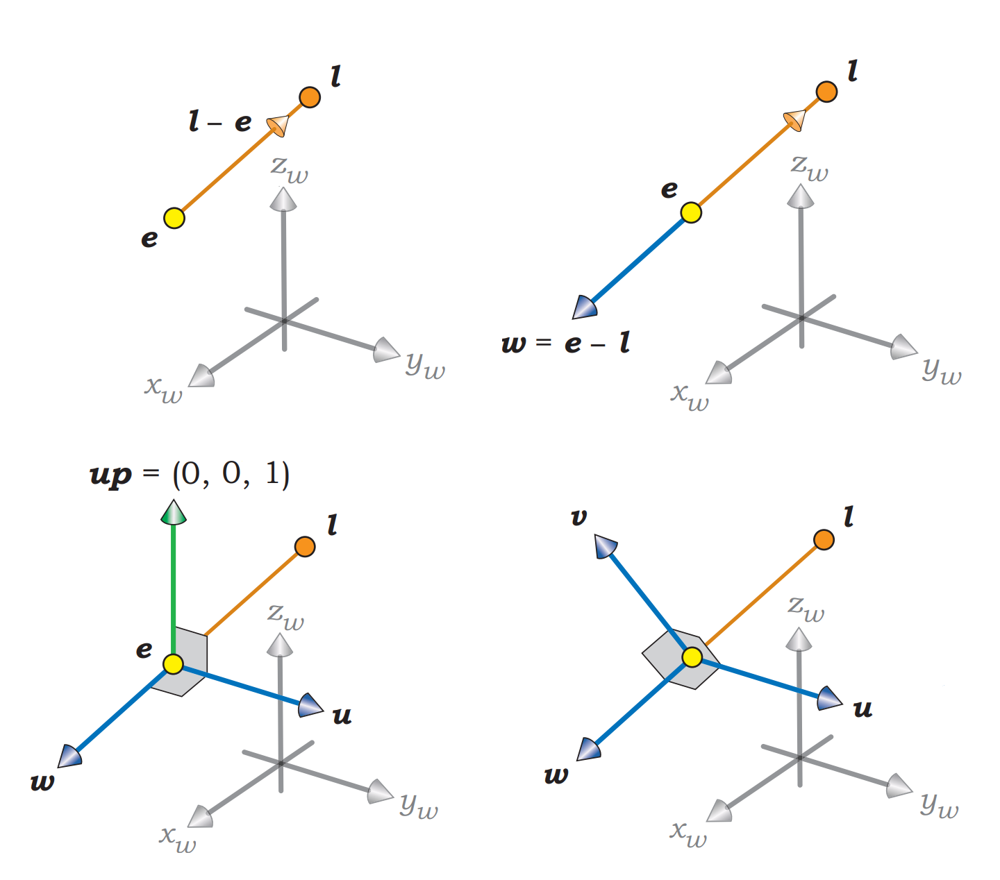

<aside>
💡 Mesmo que a base do sistema de coordenadas da câmera seja ortonormal, o parâmetro $\mathbf{up}$ deve poder ser escolhido de forma totalmente arbitrária pelo usuário (qualquer vetor não nulo do $\mathbb{R}^{3}$): sem que, necessariamente, $\mathbf{up}$ e $\overrightarrow{EL}$ sejam ortogonais, nem que $\mathbf{up}$ seja unitário.

</aside>

## *Ray-Casting*

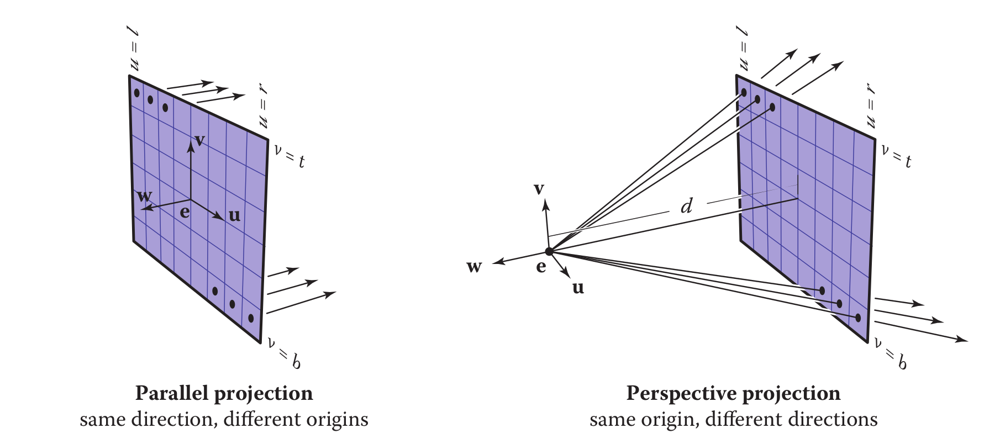

A câmera deve proporcionar uma vista em perspectiva da cena (não trabalharemos com projeção ortográfica). Para tal, os raios primários serão todos lançados partindo da origem do sistema de coordenadas da câmera (o ponto $E$), atravessando o centro de cada *pixel* da tela. Esse procedimento, chamado *Ray-Casting*, deve ser controlado pelo usuário por meio dos seguintes parâmetros:

- A resolução da tela $\texttt{v\char`_res} \times \texttt{h\char`_res}$ em número de linhas e de colunas;
- A distância $d$ entre a origem e a tela*;*
- A medida $s$ do lado dos pixels na tela.
    
    <aside>
    💡 Nas bibliotecas gráficas (e também nas questões da prova de Silvio), é mais comum que o usuário forneça o ângulo $\theta$ do campo de visão horizontal, ao invés da medida do lado dos *pixels*. Esses parâmetros são equivalentes, estando relacionados através da equação: $s(\texttt{h\char`_res} - 1) = 2d\tan(\theta/2)$. Receber diretamente como entrada o tamanho dos quadrados no *grid* simplifica o código do *Ray-Casting*, mas o ângulo de visão é um parâmetro mais intuitivo para o usuário, e o deixa mais protegido dos detalhes de implementação. Fica a critério dos alunos decidir qual dos dois utilizar no projeto.
    
    </aside>
    

## Objetos

Três tipos de objetos devem ser renderizados: esferas, planos e triângulos. Na Versão 1, o único atributo que esses objetos possuem em comum é a cor *RGB* constante **para todos os pontos da sua superfície. Os atributos específicos para o posicionamento são os seguintes:

### Esfera

- Centro $C$;
- Raio $r$.

### Plano

- Ponto $P_0$ sobre o plano;
- Vetor $\mathbf{n}$ normal ao plano (não nulo).

### Triângulo

- Ponto $A$;
- Ponto $B$;
- Ponto $C$.

$A$, $B$ e $C$ não colineares.

# Versão 2 (80%)

**Objetivo**: adicionar *shading* e sombras*,* mas sem os raios secundários (sem o *Ray-Tracing* recursivo propriamente dito).

[Testes Versão 2](items/testes-2)

## *Phong Shading*

O material de cada objeto é determinado pelos seguintes parâmetros:

- A cor difusa $\mathbf{c_d}$;
- O coeficiente ambiental $k_a$;
- O coeficiente difuso $k_d$;
- O coeficiente especular $k_s$;
- O expoente de Phong $q$.

Com $0 \leq k_a, k_d, k_s \leq 1$, e $q > 0$.

Além da luz ambiente (de cor $\mathbf{c_a}$), trabalharemos também com múltiplas fontes pontuais de luz, definidas pelos seguintes parâmetros:

- A localização da fonte $S_i$;
- A cor $\mathbf{c_i}$ (intensidade da luz).

Seja $P$ um ponto atingido por um raio primário. Recomendamos que a cor primária $\mathbf{c_p}$ do ponto $P$ seja calculada pela seguinte somatória:

$$
\mathbf{c_p} = k_a \mathbf{c_d} \odot \mathbf{c_a} + \sum_{i=1}^m{ k_d \mathbf{c_d} \odot \max(0, \mathbf{n} \cdot \mathbf{l_i}) \mathbf{c_i} }+ \sum_{i=1}^m{ k_s \big[ \max \big(0, \mathbf{r_i} \cdot \mathbf{v} \big) \big] ^q \mathbf{c_i} }
$$

- O vetor $\textbf{n}$ é **unitário** e normal à superfície do objeto;
- O vetor **v** é **unitário** e aponta para o observador (origem do raio primário);
- O vetor $\mathbf{l_i}$ é **unitário** e aponta para a localização da i-ésima fonte $S_i$;
- O vetor $\mathbf{r_i}$ é **unitário** e é obtido por meio da reflexão do vetor $\mathbf{l_i}$ no eixo da normal.

<aside>
💡 Não confunda o produto [escalar](https://numpy.org/doc/stable/reference/generated/numpy.dot.html) $\mathbf{u} \cdot \mathbf{v}$ com o produto de [Hadamard](https://numpy.org/doc/stable/reference/generated/numpy.multiply.html) *$\mathbf{u} \odot \mathbf{v}$.*

</aside>

## *Color Overflow*

Antes de avaliar a equação de Phong, é preciso que todas as cores (a cor ambiental, as cores difusas dos objetos e as cores das luzes pontuais) sejam **normalizadas**. Ou seja, se na entrada as componentes *RGB* estiverem na escala de 0 a 255, é preciso **dividir** os valores por 255, para que fiquem na escala de 0 a 1.

Por outro lado, não há qualquer garantia que o resultado da somatória ficará contido no intervalo de 0 a 1. Um jeito fácil de lidar com o *overflow* é assim: se alguma componente da cor do *pixel* exceder 1, todas as componentes são divididas por esse valor. Isso preserva a proporção entre os tons, com a componente máxima valendo extamente 1.

$$
t = \frac{255}{\max(1, c_r, c_g, c_b)}
$$

$$
\texttt{pixel\char`_color} = (\lfloor tc_r \rfloor, \lfloor tc_g \rfloor, \lfloor tc_b \rfloor)
$$

## Sombras

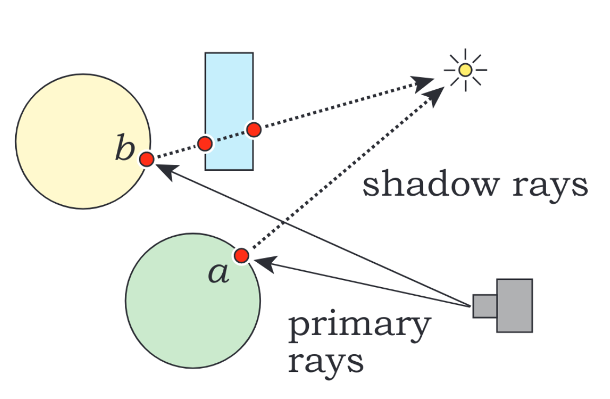

Uma sombra é uma parte da cena onde a iluminação que seria fornecida por uma fonte de luz encontra-se bloqueada por ao menos um objeto. Em termos de implementação, essa condição é verificada analisando a interseção de **raios de sombra** (partindo da superfície visível dos objetos em direção às fontes de luz) com o restante da cena. Se um ponto estiver na sombra com relação à uma fonte de luz, as componente difusa e especular serão ambas **nulas** para aquela fonte.

## *Shadow Acne*

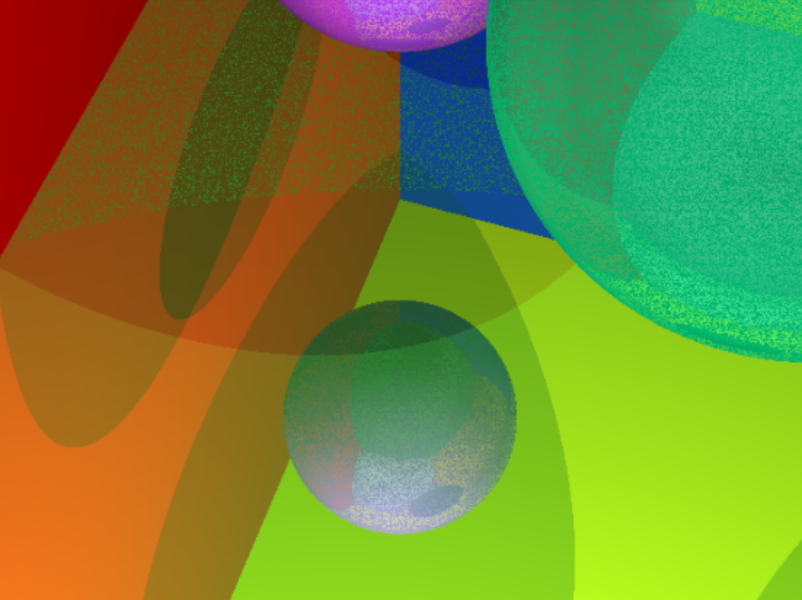

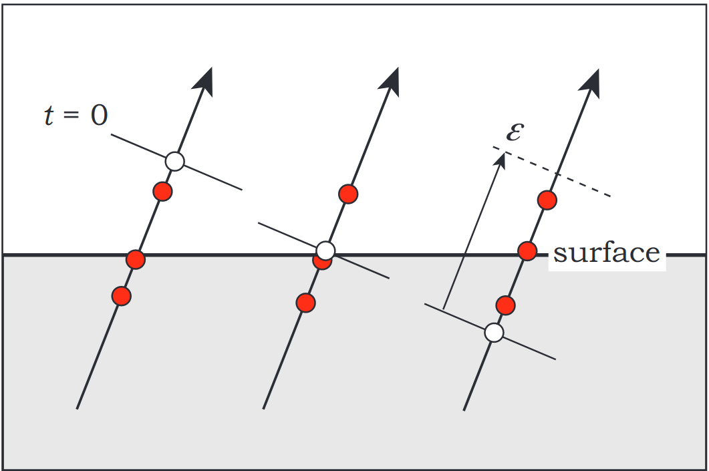

Um *bug* que sempre aparece quando adicionamos raios de sombra sem o devido cuidado é o *shadow acne*. Esse problema é causado por erros de precisão de ponto flutuante, e ocorre porque os pontos da superfície visível acidentalmente fazem sombra sobre si mesmos (o raio de sombra intersecta a superfície do próprio objeto por debaixo). Para tratá-lo, é preciso deslocar a origem dos raios por um fator $\epsilon$ muito pequeno, na direção da fonte de luz, antes de buscar as interseções.

# Versão 3 (100%)

**Objetivo**: renderizar reflexão e refração com *Ray-Tracing*.

[Testes Versão 3](items/testes-3)

## Raios Secundários

Antes de retornar a cor final do pixel correspondente, um ponto atingido por um raio primário precisará combinar duas outras cores com a cor primária (aquela que resulta da somatória de Phong): uma é a cor do ponto atingido pelo raio refletido $\mathbf{c_r}$, e a outra é a do raio refratado $\mathbf{c_t}$. Essas cores são atenuadas, respectivamente, pelos coeficientes de reflexão $k_r$ e de transmissão $k_t$:

$$
\mathbf{c_s} = \mathbf{c_p} + k_r\mathbf{c_r} + k_t\mathbf{c_t}
$$

Assim, na cor secundária $\mathbf{c_s}$, entra não só a iluminação direta (oriunda das fontes da luz), mas também a iluminação indireta (oriunda da cena ao redor).

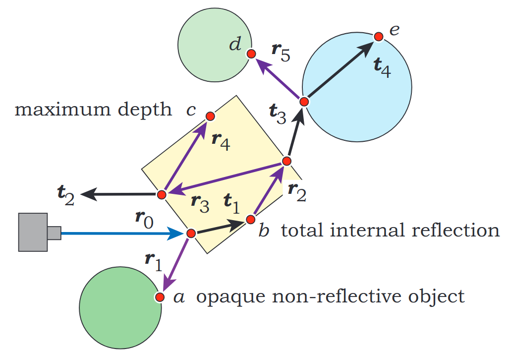

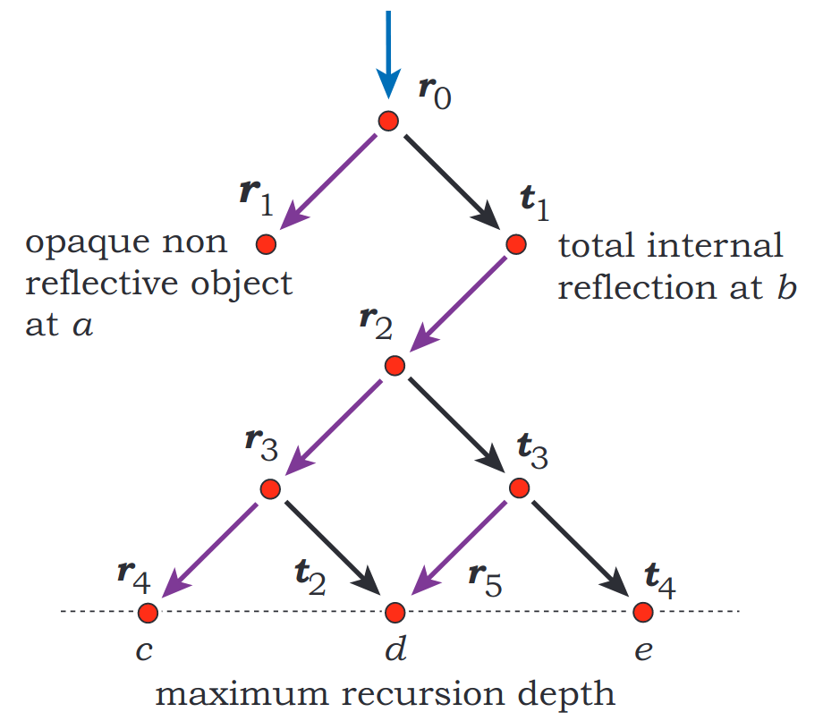

Será preciso uma função recursiva para traçar **raios secundários**. Assim como os raios primários, os raios secundários também retornam a cor do ponto mais próximo atingido. A diferença é que estes não partem do foco da câmera, mas sim da superfície dos objetos. Raios secundários dão origem a novos raios secundários, então é fundamental garantir que existe sempre um caso base, senão o programa nunca para. Isso é garantido controlando o tamanho da pilha de recursão com um *time-to-live*.

## Índice de Refração

O terceiro e último parâmetro a ser acrescentado é o índice de refração $\eta$. Essa é a grandeza física que mede o desvio sofrido pelos raios de luz ao se propagar de um meio a outro.

Na prática, não trabalharemos com o índices de refração absolutos. Facilita a implementação do *Ray-Tracing* considerar apenas o índice de refração **relativo** entre o meio interno (sentido oposto da normal) e o meio externo (mesmo sentido da normal).

$$
\eta = \frac{\eta_{in}}{\eta_{out}}
$$

## Reflexão Total

Na refração, se o ângulo de incidência $\theta_i$ for igual ou superior ao ângulo crítico $\theta_c$, será observado o fenômeno de reflexão total.

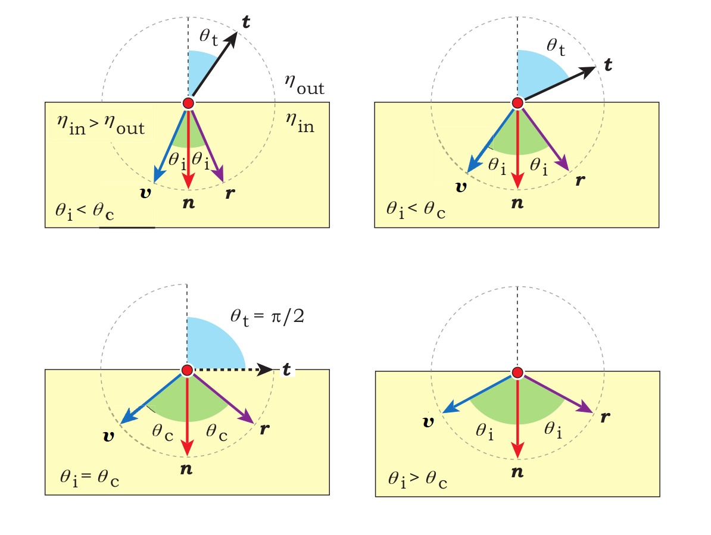

Nesse caso, o raio refratado simplesmente não existe, então a cor secundária deve receber 100% do valor retornado pelo raio refletido.

$$
\mathbf{c_s} = \mathbf{c_p} + \mathbf{c_r}
$$

# Versão 4 (120%)

**Objetivo**: acrescentar *features* avançadas baseadas em técnicas de *sampling*.

## *Antialiasing*

Um efeito desagradável aos olhos que sempre aparece quando trabalhamos com *ray-tracing* é o *aliasing*. Esse problema é caracterizado pelo aspecto serrilhado nos contornos dos objetos.

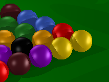

É possível tratar esse problema **em tempo de renderização**, fazendo algumas modificações no *Ray-Casting*. Ao invés de lançar um único raio por *pixel*, apontando para o centro dele, vários raios são lançados, em direções aleatórias, tirando depois a média das cores obtidas.

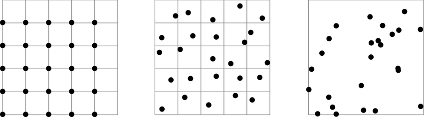

Sem *sampling*, *jittered sampling* e *random sampling*.

No entanto, se a amostragem aleatória for feita sem cuidado, as imagens podem acabar sendo renderizadas com *noise*, o que apenas substitui o problema do *aliasing* por outro tão ruim quanto. Por essa razão, o *antialiasing* deverá feito com a técnica de ***jittered sampling***. Para mais detalhes, consultar o livro *Ray Tracing From The Ground Up*, Capítulo 4*.*

[Ray Tracing from the Ground Up by Suffern, Kevin.pdf](https://drive.google.com/file/d/1hJsPDYlRIpTrW1MGCFeWw9nPlVEMDgok/view?usp=drivesdk)

## *Soft Shadows*

O modelo mais simples possível de iluminação para o *ray-tracing* utiliza apenas fontes pontuais de luz. O problema dessa abordagem está na nitidez grosseira observada no contorno das sombras. Isso ocorre porque cada ponto da superfície recebe ou nenhuma, ou total iluminação da fonte de luz.

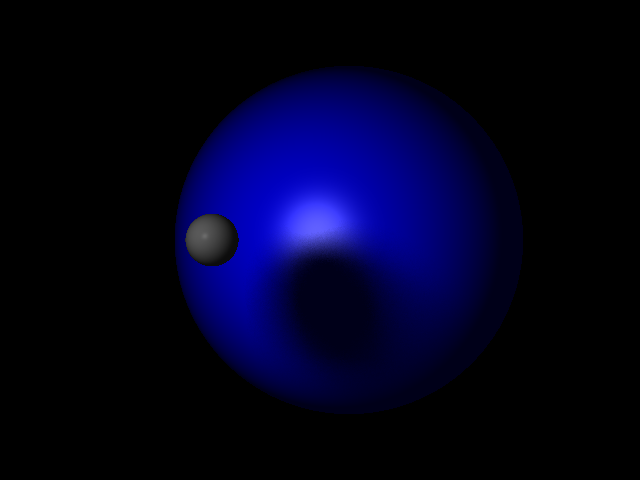

Para conseguir o efeito de penumbra, e, consequentemente, aumentar o realismo da cena, é preciso trabalhar com **fontes extensas** de luz. Nessa abordagem, múltiplos raios de sombra são lançados na direção de pontos aleatórios sobre a superfíce da luz. Para o projeto, fontes de formato **retangular** serão suficientes, aplicando a técnica de *jittered sampling* (de maneira análoga ao *antialiasing*).

Os alunos devem seguir como referência o seguinte artigo:

[Rendering soft shadows](http://raytracerchallenge.com/bonus/area-light.html)